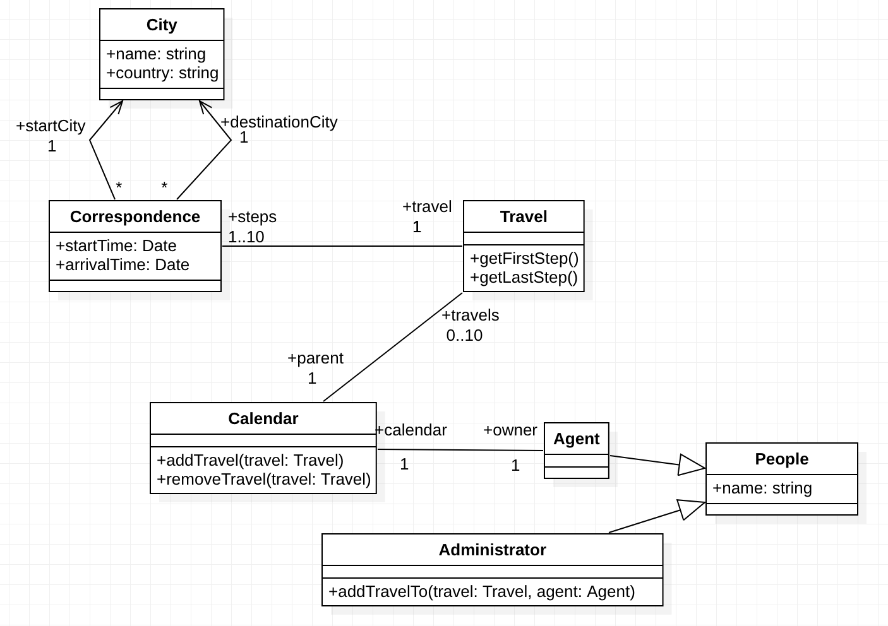

# travel-agency

The Travel Agency est un logiciel de gestion de réservation de voyage.
Dans le cadre de ce projet, vous allez contribuer au développement de ce logiciel.

# Organisation

Ce travail sera réalisé par groupe de 2 étudiants.

Quelques règles de mise en œuvre et gestion du projet:

1. Avant toutes choses, créez un **"Fork"** du projet sur le serveur.
Pour ce faire, cliquez sur l'icône "Fork" de la page du projet our accéder au lien suivant: [https://gitlab.univ-nantes.fr/naomod/software-construction-course/alma-gtd/forks/new](https://gitlab.univ-nantes.fr/naomod/software-construction-course/alma-gtd/forks/new)

2. Clonez **votre fork du projet** (et non pas celui d'origine). Toutes vos modifications devront être poussées sur votre fork.

3. **Il ne doit y avoir qu'un seul "fork" par groupe d'étudiants.** Il sera utilisé comme espace de rendu des fichiers lié au projet.

4. Avant toute modification, vous devez créer un "problème" (**Issue**) sur votre projet. Cette issue décrira la fonctionnalité que vous souhaitez ajouter. Et après la modification, vous devez faire une validation (Commit) en référence à ce problème.

5. Le cycle de travail sera donc le suivant: Analyse -> Création d'une issue sur votre projet Gitlab -> Modification des sources -> Validation.

# Travail à réaliser

**Le travail à réaliser est réparti en 4 tâches**, plus une tâche bonus. Vous serez noté sur la qualité de réalisation des tâches. La dernière tâche, en bonus, est optionelle et n'apportera que des points bonus.

L'ordre des tâches vous donne une idée de l'ordre dans lequel réaliser le projet. Vous n'êtes pas forcément obligé de respecter cet ordre, tant que toutes les tâches sont complétées à la fin du projet.

Le code du projet est là pour vous fournir une base de code. Vous êtes libre de **modifier l'implémentation comme vous l'entendez**, voir même de modifier le modèle UML en lui même ! Attention cependant, **vous devrez motiver tous vos choix d'implémentation !**

## Evaluation

* Le travail à rendre se composera des sources java du projet et de l'historique de commits. Pensez à soigner vos messages, en indiquant bien le but de chaque commit, quelle issue il règle, etc.

* Pour être évalué, tout étudiant doit participer activement du projet, en réalisant des "commits", en ajoutant des lignes de code, en ouvrant des "issues" sur le serveur GitLab, etc.

* L'évaluation portera sur la qualité des modifications apportées au projet: code, test unitaires, javadoc, commentaires, etc.

## Dépendances Maven

Le projet de démarrage est configuré comme un projet Maven standard. Vous êtes libres d'ajouter de nouvelles extensions lors du développement du projet. Par défaut, les dépendances suivantes sont configurées:
* JUnit ([https://junit.org/junit5/](https://junit.org/junit5/)) pour gérer les tests.

* Joda Time ([https://www.joda.org/joda-time/](https://www.joda.org/joda-time/)) pour manipuler des dates.

* Apache Commons Lang ([https://commons.apache.org/proper/commons-lang/](https://commons.apache.org/proper/commons-lang/)) qui fournit une extension de la librairie Java standard.

# Tâches à réaliser

Vous trouverez çi-dessous le diagramme UML du projet, ainsi que toutes les tâches à réaliser.

## Tâche 1 : Contraintes du modèle

Le code donnée au démarrage du projet ne vérifie aucune des contraintes indiquée dans le modèle UML (contraintes d'unicité, cardinalité et intégrité des associations, handshake, etc).

Votre première tâche est d'implémenter toutes ces contraintes. Pour ce faire, nous vous proposons le protocole de travail suivant:

1. Identifier toutes les contraintes du modèle. Essayer de les réduire le plus possible, pour arriver à un ensemble de contraintes dites "atomiques". Un bon exemple est "Un calendrier ne peut appartenir qu'à une seule personne".

2. Pour chaque contrainte atomique, ouvrez une isue correspondante, qui décrit la contrainte à vérifier et les classes concernées.

3. Pour chaque contrainte, implémenter le nécessaire pour la vérifier, puis faites un commit qui référence l'issue associée.

## Tâche 2 : Tests du modèle

Comme précédemment, le code fourni au démarrage présente un autre défaut: il ne contient aucun test ! Votre tâche suivante est **d'implémenter une suite de tests pour valider l'implémentation du modèle**. En d'autres termes, *il vous faut tester tout le code produit pour la tâche précédente* ;-)

En résumé, vous devez:
* Identifier des cas de tests pour valider le comportement de chaque méthode du projet. Vous penserez notamment à valider que toutes les containtes identifiées précédemment sont correctement vérifiées.

* Écrire la suite de tests correspondante en utilisant la librairie JUnit.

* Maximiser la couverture de code atteinte par vos tests.

## Tâche 3 : Gestion des utilisateurs

Pour cette tâche, on vous demande d'ajouter une nouvelle fonctionnalité au projet: la gestion des utilisateurs. Vous devez étendre le modèle UML et l'implémenter pour ajouter les fonctionnalités suivantes:

* Gestion d'une liste d'utilisateurs (agent ou administrateur) avec support pour l'ajout et la suppression.
* Gestion de l'identification des utilisateurs: chaque utilisateur doit pouvoir se connecter avec un mot de passe, dont la vérification sera géré par le logiciel.
* Filtrage de la liste ??

## Tâche 4 : Interface graphique

La dernière étape du projet consiste à implémenter une interface graphique pour pouvoir utiliser le logiciel. Pour ce faire, vous utiliserez la librairie JavaFx, présente dans le JDK Java par défaut. Un code de démarrage vous est fourni dans la classe `GUI` (package `fr.unantes.software.construction.ui`).

Vpus n'êtes pas obligé de réaliser une **belle** interface, tant qu'elle respecte les consignes et qu'elle est facilement utilisable.

Les fonctionnalités minimum à implémenter sont les suivantes:
1. Gestion de la connexion/déconnexion de l'utilisateur.

2. Enregistrement d'un nouvel utilisateur (avec mot de passe).

3. Réservation/annulation d'un voyage (avec ou sans correspondances) par un agent.

4. Réservation/annluation d'un voyage (avec ou sans correspondances) par un administrateur pour le compte d'un agent.

5. Ajout de nouvelles destinations (villes) pour les voyages.

## Tâche bonus : Persistence des données

**Attention: les tâches suivantes sont optionelles et ne doivent être considérés qu'une fois les autres tâches terminés.**

Pour les hackers fous ou ceux en avance, vous pouvez également essayer d'implémenter un stockage persitant des informations du logiciel. En l'état, toutes les données sont perdues à la fermeture de la fenête. Vous pouvez travailler à mettre en oeuvre une solution pour que les données soient conservées d'une session sur l'autre.

Quelques pistes:
* La librairie Java standard supporte la serialization/deserialization d'objets sur le disque. Plus d'informations: https://www.tutorialspoint.com/java/java_serialization.htm
* La librairie `SQLite` permet de gérer une base données SQL stockée dans un simple fichier. Plus d'informations: http://www.sqlitetutorial.net/sqlite-java/
