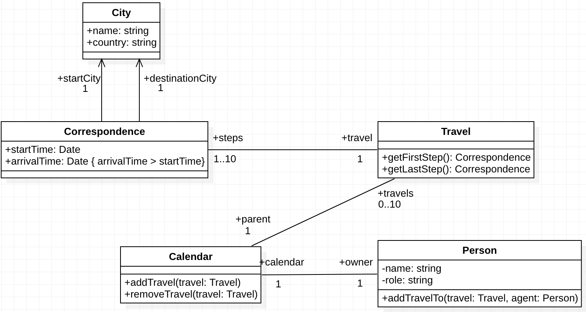

# Travel Agency

The Travel Agency est un logiciel de gestion de réservation de voyage.
Dans le cadre de ce projet, vous allez contribuer au développement de ce logiciel.

## Organisation

Ce projet  sera réalisé par groupe de 3 étudiants.
Vous allez suivre le processus de maintenance vu en cours.
Pour rappel:

Commencez par préparer l'environnement de votre projet:

1. Avant toutes choses, un membre du groupe doit créer un **"Fork"** du projet sur le serveur.
Pour ce faire, cliquez sur l'icône "Fork" (ou "Créer une divergence" en français) de la page du projet pour accéder au lien suivant: [https://gitlab.univ-nantes.fr/naomod/software-construction-course/alma-gtd/forks/new](https://gitlab.univ-nantes.fr/naomod/software-construction-course/alma-gtd/forks/new)

2. Ajouter tous les autres membres du groupe à votre fork.

3. Créez des étiquettes pour organiser les tickets du projet: _bug_, _improvement_, _smell_, _performance_, etc.

4. Chaque membre du groupe doit cloner **votre fork du projet** (et non pas celui d'origine).
Toutes vos modifications devront être poussées sur votre _fork_ et toutes les issues (ou "tickets" en français) ouvertes le seront sur votre version du projet.

5. **Il ne doit y avoir qu'un seul "fork" par groupe d'étudiants.** Il sera utilisé comme espace de rendu des fichiers lié au projet.

## UML du logiciel

## Travail à réaliser

Le travail à réaliser est réparti en différentes "issues" (ou tickets), répertoriées dans le fichier [`ISSUES.md`](https://gitlab.univ-nantes.fr/naomod/software-construction-course/travel-agency/blob/master/ISSUES.md). **Le but du projet est de résoudre tous ces tickets.** Pour ce faire, **vous devrez suivre le protocole de travail suivant**, suivant la méthodologie Test-Driven Development (TDD).

Pour chaque ticket du fichier [`ISSUES.md`](https://gitlab.univ-nantes.fr/naomod/software-construction-course/travel-agency/blob/master/ISSUES.md):

1. Ouvrez un ticket dans votre projet Gitlab (sur l'interface en ligne de Gitlab, section *Tickets*). Vous y détaillerez les points suivants:

  - Un bref résumé du problème lié au ticket.
  - Quels sont les tests à mettre en oeuvre pour vérifier que le ticket a bien été résolu ?
  - Comment la solution au ticket doit être mise en oeuvre ?

2. **Associer un membre du groupe** à la résolution du ticket, via l'interface de GitLab. Cette personne, et uniquement celle-ci, sera chargée de résoudre le ticket.

3. Créer les tests unitaires qui permettront de vérifier d'abord qu'il s'agit bien d'un problème et ensuite de la résolution du ticket.
Pour le nommage de vos tests, vous pouvez vous référer à la ressource suivante: [https://dzone.com/articles/7-popular-unit-test-naming](https://dzone.com/articles/7-popular-unit-test-naming).

4. Implémenter le code qui résout le ticket. Les tests écrits précédemment devront valider votre implémentation. *Faites attention à la régression!*: toute modification ne doit pas "casser" du code qui marchait auparavant (les autres tests unitaires doivent passer).

5. Si jamais vous devez changer d'approche au niveau des tests, de l'implémentation, etc, **ajouter un commentaire sur le ticket Gitlab**  pour documenter tout changement. **N'éditez pas le texte du ticket original**, afin de garder un historique de votre travail.

6. Effectuer un (ou plusieurs) commit(s) pour pousser vos modifications sur le dépôt, en référençant le numéro du ticket et en indiquant votre progression dans sa résolution. Nous vous invitons à lire le billet suivant à ce sujet: [https://chris.beams.io/posts/git-commit/](https://chris.beams.io/posts/git-commit/).

7. Enfin, quand le ticket est résolu, marquez-le comme "résolu" dans l'interface de Gitlab.
Vous pouvez aussi fermer les tickets automatiquement à l'intérieur d'un message de commit: [Automatic issue closing](https://docs.gitlab.com/ee/user/project/issues/automatic_issue_closing.html)

Le code du projet est là pour vous fournir une base de code. Vous êtes libre de *modifier l'implémentation comme vous l'entendez*, voire même de modifier le modèle UML en lui même !  **Mais attention, vous devrez motiver tous vos changements dans vos différents tickets/commits !!!**

## Evaluation

- Le travail à rendre se composera de votre **fork en ligne Gitalb**, sur lequel vous aurez poussé toutes vos modifications. Cela inclut également tous les messages de commits et tickets ouverts.

- Si vous le souhaitez, vous pouvez ajouter un fichier "`RENDU.md`" à la racine du projet, afin de décrire les spécificités de votre projet (choix techniques, parties non traitées, extensions non demandées, etc.).

- Pour être évalué, **tout étudiant doit participer activement du projet**, en réalisant des "commits", en ajoutant des lignes de code, en ouvrant des tickets sur le serveur GitLab, etc.

- L'évaluation portera sur les critères suivants :

  - Respect du protocole de développement donné dans l'énoncé (ouverture du ticket -> écriture des tests -> développement -> commits -> fermeture du ticket).
  - Qualité des tickets ouverts sur votre projet Gitlab: description du problème, des tests requis et de la solution mise en oeuvre.
  - Qualité du code produit.
  - Qualité et pertinence des tests unitaires mis en place.
  - Approche choisie pour résoudre chaque ticket.
  - Qualité des messages de commits.

**Ne sacrifiez pas la qualité à la quantité!** Il vaut mieux rendre un projet bien réalisé avec des tickets non résolus qu'un projet avec tous les tickets mal résolus.

## Détecter les erreurs de code avec IntelliJ et Sonarlint

L'éditeur IntelliJ propose un plugin appelé [Sonarlint](https://www.sonarlint.org/), capable de détecter les code smells dans vos projets.
Nous vous recommandons de l'installer et de l'utiliser dans le cadre de ce projet.

Pour l'installer, vous avez deux options:

1. Aller dans le menu "Préférences" de IntelliJ -> Section "Plugins", chercher "Sonarlint" puis cliquer sur "Installer".
2. Installer le manuellement : [https://plugins.jetbrains.com/plugin/7973-sonarlint](https://plugins.jetbrains.com/plugin/7973-sonarlint)

## Dépendances Maven

Le projet de démarrage est configuré comme un projet Maven standard. Vous êtes libres d'ajouter de nouvelles extensions lors du développement du projet. Par défaut, les dépendances suivantes sont configurées:

- JUnit ([https://junit.org/junit5/](https://junit.org/junit5/)) pour gérer les tests.

- Apache Commons Lang ([https://commons.apache.org/proper/commons-lang/](https://commons.apache.org/proper/commons-lang/)) qui fournit une extension de la librairie Java standard.
